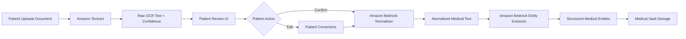
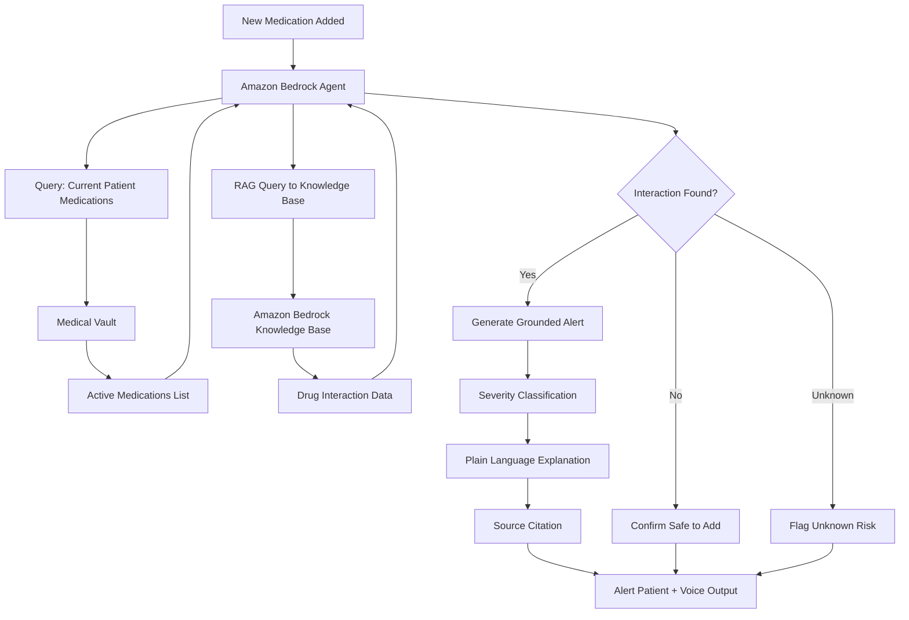
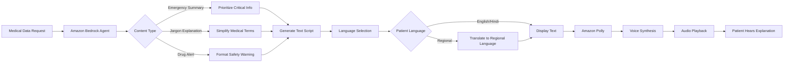
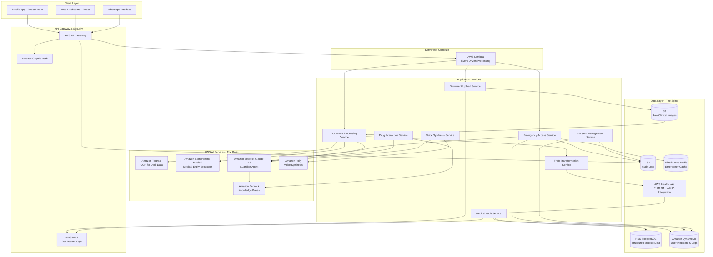
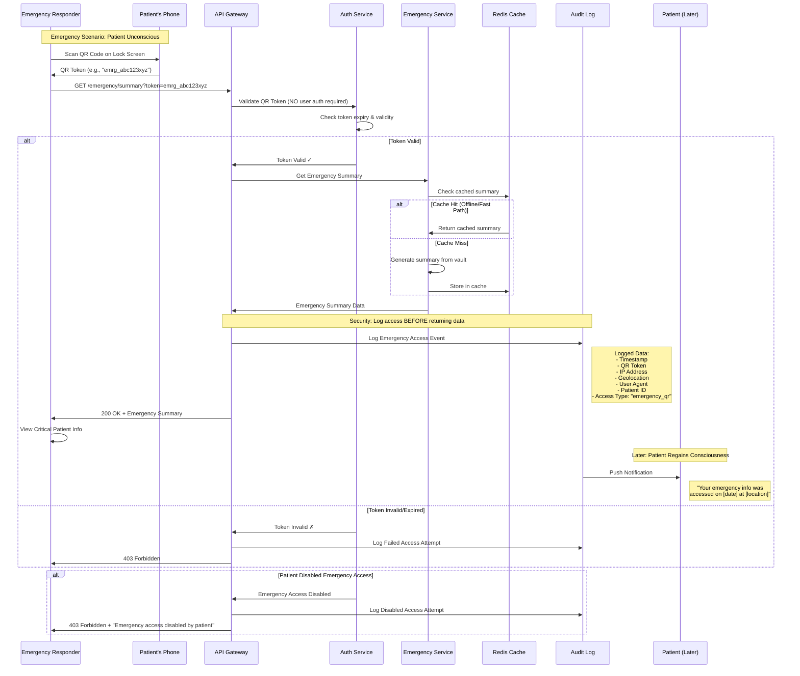

# Design Document: MediVault AI Healthcare

## Overview

MediVault is a patient-owned AI medical vault system that addresses the critical problem of fragmented medical records in India and similar healthcare settings. The system uses a multi-stage AI pipeline powered by AWS-native services to transform unstructured medical documents (handwritten prescriptions, scanned reports, images) into structured, searchable medical data stored in a secure, patient-controlled vault.

Built for the AWS AI for Bharat Hackathon, MediVault leverages Amazon Bedrock for agentic reasoning, Amazon Textract for document processing, Amazon Polly for voice accessibility, and Amazon Bedrock Knowledge Bases for grounded medical knowledge retrieval.

The architecture follows a microservices approach with clear separation between document processing, data storage, access control, and emergency services. The system is designed to be mobile-first, privacy-preserving, and scalable to national deployment levels.

### Key Design Principles

1. **Patient Ownership**: Patients have complete control over their data and who can access it
2. **Privacy by Design**: All data is encrypted at rest and in transit, with minimal data exposure
3. **AI-Driven Automation**: No manual data entry required - AI handles document processing, normalization, and extraction
4. **Human-in-the-Loop**: Patients validate AI extractions to ensure 100% data accuracy
5. **Safety-First**: RAG-grounded drug interactions prevent AI hallucinations in critical safety decisions
6. **Emergency-First**: Critical information is always accessible in emergencies via QR code, even offline
7. **Accessibility**: Voice output in regional languages ensures inclusivity for patients with limited literacy
8. **Interoperability**: Standards-based data formats (FHIR) for integration with external systems
9. **Scalability**: Cloud-native architecture designed for millions of users

## Three Core Architectural Flows

MediVault's architecture is organized around three critical flows that demonstrate the system's agentic capabilities, safety mechanisms, and accessibility features:

### 1. The Trusted Pipeline (HITL & Normalization)

This flow ensures that raw data from Amazon Textract is verified by the patient before the Amazon Bedrock Agent structures it, guaranteeing 100% data accuracy.



**Key Components**:
- **Amazon Textract**: Extracts handwritten and printed text from medical documents (English/Hindi)
- **Human-in-the-Loop UI**: Presents extracted text to patient for confirmation or editing
- **Amazon Bedrock Normalizer**: Cleans and standardizes patient-verified text using medical knowledge
- **Amazon Bedrock Entity Extractor**: Structures normalized text into medical entities (medications, conditions, allergies)

**Safety Mechanism**: By requiring patient validation before normalization, the system prevents OCR errors from propagating through the pipeline. This is critical for medical data where a single misread digit in a dosage could be dangerous.

### 2. The Safety Engine (RAG & Interaction Checking)

This flow demonstrates the agentic nature of the project. The Amazon Bedrock agent doesn't "guess" drug interactions—it autonomously queries a Knowledge Base using RAG (Retrieval-Augmented Generation) to ground all safety alerts in authoritative medical sources.



**Key Components**:
- **Amazon Bedrock Agent**: Autonomous reasoning engine that orchestrates the interaction checking process
- **Amazon Bedrock Knowledge Base**: Contains authoritative drug interaction databases (DrugBank, FDA drug labels, clinical guidelines)
- **RAG (Retrieval-Augmented Generation)**: Grounds all interaction alerts in retrieved documents, preventing hallucinations
- **Severity Classifier**: Autonomously assigns risk levels (minor, moderate, severe) based on clinical guidelines
- **Explanation Generator**: Creates plain-language explanations with source citations

**Hallucination Prevention**: The agent NEVER generates interaction warnings without Knowledge Base evidence. If no interaction data exists, it explicitly states "unknown interaction risk" rather than falsely claiming safety.

### 3. The Accessibility Layer (Polly & Multi-language)

This flow handles the transformation of complex medical data into regional voice output, satisfying the Bharat-specific impact requirement and ensuring accessibility for patients with limited literacy.



**Key Components**:
- **Amazon Bedrock Agent**: Generates simplified, voice-optimized medical explanations
- **Content Simplification**: Adapts medical jargon to 6th-8th grade reading level
- **Pronunciation Optimization**: Formats drug names with phonetic hints for Amazon Polly
- **Amazon Polly**: Synthesizes natural-sounding speech in 7+ Indian languages (Tamil, Telugu, Bengali, Marathi, Gujarati, Kannada, Malayalam)
- **Cultural Adaptation**: Adjusts explanations for regional cultural context

**Accessibility Impact**: Rural patients with limited literacy can understand their medical information through voice output in their native language, democratizing access to healthcare technology.

## Architecture

### High-Level Architecture with AWS Services



### Component Architecture

The system is organized into the following major components:

**Core AI & Intelligence (The Brain)**:
1. **Amazon Textract**: High-accuracy OCR for handwritten prescriptions and lab reports, converting "Dark Data" into machine-readable text
2. **Amazon Comprehend Medical**: Extracts complex medical entities (medications, dosages, protected health information) for clinical accuracy
3. **Amazon Bedrock (Claude 3.5)**: Powers the "Guardian Agent" to synthesize massive longitudinal records into 2-second emergency summaries

**Data Foundation & Interoperability (The Spine)**:
4. **AWS HealthLake**: Standardizes unstructured data into FHIR R4 JSON format, enabling seamless integration with ABHA national health stack
5. **Amazon S3**: Secure, durable object storage for raw clinical images before AI pipeline processing
6. **Amazon DynamoDB**: High-performance NoSQL database for user metadata, emergency access logs, and ABHA ID mappings

**Security & Serverless Infrastructure (The Shield)**:
7. **AWS KMS**: Per-Patient Managed Keys ensuring patient data remains encrypted and private even at clinic level
8. **AWS Lambda**: Serverless compute layer triggering transformation and standardization stages automatically upon file upload
9. **Amazon API Gateway**: Secure entry point for mobile and WhatsApp-based interactions

**Additional Components**:
10. **Client Applications**: Mobile app (React Native), web dashboard (React), WhatsApp interface
11. **Medical Vault Service**: Core data storage and retrieval
12. **Emergency Access Service**: QR code generation and emergency summary with offline caching
13. **Consent Management Service**: Access control and sharing permissions
14. **Drug Interaction Service**: RAG-based medication safety checking
15. **Voice Synthesis Service**: Amazon Polly for multilingual voice output
16. **FHIR Transformation Service**: Converts medical entities to FHIR R4 format
17. **RDS PostgreSQL**: Structured medical entities storage
18. **ElastiCache Redis**: Emergency summary caching

1. **Client Applications**: Mobile app (React Native) and web dashboard (React)
2. **API Gateway**: AWS API Gateway with Cognito for authentication, rate limiting, request routing
3. **Document Processing Pipeline**: Amazon Textract → Amazon Bedrock (Normalization) → Amazon Bedrock (Entity Extraction)
4. **Medical Vault Service**: Core data storage and retrieval
5. **Emergency Access Service**: QR code generation and emergency summary with offline caching
6. **Consent Management Service**: Access control and sharing permissions
7. **Drug Interaction Service**: RAG-based medication safety checking using Amazon Bedrock + Knowledge Bases
8. **Voice Synthesis Service**: Amazon Polly for multilingual voice output
9. **Data Layer**: RDS PostgreSQL for structured data, S3 for documents and logs, ElastiCache Redis for caching

## Components and Interfaces

### 1. Document Upload Service

**Responsibility**: Handle document uploads from mobile and web clients, validate files, and queue them for processing.

**Interface**:
```typescript
interface DocumentUploadService {
  // Upload a single document
  uploadDocument(
    patientId: string,
    file: File,
    metadata: DocumentMetadata
  ): Promise<UploadResult>
  
  // Get upload status
  getUploadStatus(uploadId: string): Promise<UploadStatus>
  
  // Retry failed upload
  retryUpload(uploadId: string): Promise<UploadResult>
}

interface DocumentMetadata {
  documentType: 'prescription' | 'lab_report' | 'discharge_summary' | 'other'
  captureDate: Date
  notes?: string
}

interface UploadResult {
  uploadId: string
  status: 'queued' | 'processing' | 'completed' | 'failed'
  documentUrl?: string
}
```

**Key Operations**:
- Validate file size (max 10MB) and format (JPEG, PNG, PDF)
- Generate unique upload ID
- Store document in object storage (S3)
- Queue document for processing
- Handle retry logic for failed uploads

### 2. Document Processing Service (Trusted Pipeline)

**Responsibility**: Orchestrate the AI pipeline to extract and structure medical data from documents with human-in-the-loop validation.

**Interface**:
```typescript
interface DocumentProcessingService {
  // Process a document through the full pipeline
  processDocument(uploadId: string): Promise<ProcessingResult>
  
  // Get processing status
  getProcessingStatus(uploadId: string): Promise<ProcessingStatus>
  
  // Submit patient verification/corrections
  submitPatientVerification(
    uploadId: string,
    verification: PatientVerification
  ): Promise<void>
}

interface ProcessingResult {
  uploadId: string
  extractedText: string
  normalizedText: string
  entities: MedicalEntity[]
  confidence: number
  warnings: string[]
  requiresPatientVerification: boolean
}

interface ProcessingStatus {
  stage: 'textract' | 'patient_verification' | 'normalization' | 'extraction' | 'storage' | 'completed'
  progress: number
  errors?: string[]
  extractedText?: string  // Available after Textract stage for patient review
  confidence?: number
}

interface PatientVerification {
  action: 'confirm' | 'edit'
  correctedText?: string  // Required if action is 'edit'
  timestamp: Date
}
```

**Pipeline Stages (Trusted Pipeline)**:
1. **Amazon Textract Stage**: Extract text from image/PDF
2. **Patient Verification Stage (HITL)**: Present extracted text to patient for confirmation or editing
3. **Amazon Bedrock Normalization Stage**: Clean and standardize patient-verified text
4. **Amazon Bedrock Extraction Stage**: Identify and structure medical entities
5. **Storage Stage**: Save structured data to vault

**Human-in-the-Loop Implementation**:
- After Textract extraction, the system pauses and presents the raw OCR text to the patient
- Patient can either:
  - **Confirm**: Accept the extraction as accurate (proceeds to normalization)
  - **Edit**: Make inline corrections to fix OCR errors (corrected text proceeds to normalization)
- Patient-verified text is marked with a verification flag and timestamp
- This ensures 100% data accuracy for critical medical information before AI processing

### 3. Document Processor (Amazon Textract)

**Responsibility**: Extract text from medical documents (handwritten and printed) using Amazon Textract.

**Interface**:
```typescript
interface DocumentProcessor {
  // Extract text from document
  extractText(documentUrl: string): Promise<TextractResult>
}

interface TextractResult {
  rawText: string
  confidence: number
  language: string[]  // Detected languages (English, Hindi)
  qualityWarning?: string
  blocks?: TextBlock[]  // Textract block-level data
}

interface TextBlock {
  text: string
  confidence: number
  blockType: 'LINE' | 'WORD'
  geometry: BoundingBox
}
```

**Implementation Approach**:
- Use Amazon Textract for document text extraction
- Support for handwritten and printed text in English and Hindi
- Confidence scoring for each extracted text block
- Quality assessment based on image resolution and clarity
- Returns structured block-level data for potential UI highlighting

### 4. AI Text Normalizer (Amazon Bedrock)

**Responsibility**: Clean noisy OCR output and standardize medical terminology using Amazon Bedrock.

**Interface**:
```typescript
interface AITextNormalizer {
  // Normalize medical text
  normalize(rawText: string, context: NormalizationContext): Promise<NormalizedText>
}

interface NormalizationContext {
  documentType: string
  language: string
  ocrConfidence: number
  patientVerified: boolean  // True if patient confirmed/edited the text
}

interface NormalizedText {
  cleanedText: string
  corrections: Correction[]
  confidence: number
}

interface Correction {
  original: string
  corrected: string
  type: 'spelling' | 'abbreviation' | 'dosage' | 'terminology'
  confidence: number
  source?: string  // Knowledge Base reference if applicable
}
```

**Implementation Approach**:
- Use Amazon Bedrock (Claude or other foundation models) for text normalization
- Query Amazon Bedrock Knowledge Bases for medical terminology validation
- Context-aware correction (e.g., "tab" → "tablet" in medication context)
- Dosage standardization (e.g., "1-0-1" → "1 tablet morning, 1 tablet night")
- Higher confidence when processing patient-verified text vs. raw OCR output

### 5. Entity Extractor (Amazon Bedrock + Amazon Comprehend Medical)

**Responsibility**: Identify and structure medical entities from normalized text using Amazon Bedrock and Amazon Comprehend Medical for enhanced clinical accuracy.

**Interface**:
```typescript
interface EntityExtractor {
  // Extract medical entities using dual AI approach
  extractEntities(normalizedText: string): Promise<MedicalEntity[]>
  
  // Extract protected health information (PHI)
  extractPHI(text: string): Promise<PHIEntity[]>
}

interface MedicalEntity {
  type: EntityType
  value: string
  confidence: number
  metadata: EntityMetadata
  sourceText: string
  knowledgeBaseReference?: string  // Reference to Knowledge Base entry
  comprehendMedicalCategory?: string  // Category from Comprehend Medical
}

type EntityType = 
  | 'medication'
  | 'condition'
  | 'allergy'
  | 'lab_test'
  | 'vital_sign'
  | 'procedure'
  | 'protected_health_information'

interface EntityMetadata {
  // For medications
  dosage?: string
  frequency?: string
  duration?: string
  route?: string
  
  // For lab tests
  testName?: string
  value?: number
  unit?: string
  referenceRange?: string
  
  // For conditions
  severity?: string
  onset?: Date
  status?: 'active' | 'resolved' | 'chronic'
  
  // From Comprehend Medical
  rxNormCode?: string  // RxNorm code for medications
  icd10Code?: string   // ICD-10 code for conditions
  snomedCode?: string  // SNOMED CT code
}

interface PHIEntity {
  type: 'NAME' | 'AGE' | 'ID' | 'PHONE' | 'EMAIL' | 'ADDRESS' | 'DATE'
  value: string
  confidence: number
}
```

**Implementation Approach (Dual AI System)**:

**Amazon Comprehend Medical** (Primary Medical Entity Extraction):
- Detects and extracts medical entities with high clinical accuracy:
  - **Medications**: Drug names, dosages, frequencies, routes, strengths
  - **Medical Conditions**: Diseases, symptoms, diagnoses with ICD-10 codes
  - **Protected Health Information (PHI)**: Names, ages, dates, IDs for privacy protection
  - **Test, Treatment, Procedure (TTP)**: Lab tests, procedures, treatments
  - **Anatomy**: Body parts and anatomical locations
- Provides standardized medical codes (RxNorm, ICD-10, SNOMED CT)
- Confidence scores for each extracted entity
- Relationship detection (medication → condition, test → result)

**Amazon Bedrock** (Contextual Enhancement):
- Enhances Comprehend Medical output with contextual understanding
- Resolves ambiguities using medical knowledge from Knowledge Bases
- Fills gaps in entity metadata (e.g., medication duration, condition onset)
- Validates extracted entities against medical ontologies
- Generates structured JSON output

**Hybrid Workflow**:
1. Normalized text → Amazon Comprehend Medical (primary extraction)
2. Comprehend Medical output → Amazon Bedrock (contextual enhancement)
3. Bedrock queries Knowledge Bases for validation and enrichment
4. Combined output with high clinical accuracy and contextual relevance

**Clinical Accuracy Benefits**:
- Comprehend Medical trained on millions of clinical documents
- Automatic medical code assignment (RxNorm, ICD-10, SNOMED CT)
- PHI detection for privacy compliance
- Confidence scoring for each entity
- Automatic flagging of critical entities (allergies) for safety

### 6. Medical Vault Service

**Responsibility**: Store, retrieve, and manage structured medical data for patients.

**Interface**:
```typescript
interface MedicalVaultService {
  // Store medical entities
  storeEntities(
    patientId: string,
    entities: MedicalEntity[],
    sourceDocumentId: string
  ): Promise<void>
  
  // Retrieve patient's medical timeline
  getTimeline(
    patientId: string,
    filters?: TimelineFilters
  ): Promise<TimelineEntry[]>
  
  // Get current medications
  getCurrentMedications(patientId: string): Promise<Medication[]>
  
  // Get active conditions
  getActiveConditions(patientId: string): Promise<Condition[]>
  
  // Get allergies
  getAllergies(patientId: string): Promise<Allergy[]>
  
  // Export data in FHIR format
  exportFHIR(patientId: string): Promise<FHIRBundle>
}

interface TimelineFilters {
  startDate?: Date
  endDate?: Date
  entityTypes?: EntityType[]
  searchQuery?: string
}

interface TimelineEntry {
  date: Date
  entities: MedicalEntity[]
  sourceDocument: DocumentReference
  addedAt: Date
}
```

**Data Storage**:
- PostgreSQL for structured medical entities
- Indexed by patient ID, entity type, date
- Full-text search on entity values and metadata
- Deduplication logic for similar entities

### 6.5. FHIR Transformation Service (AWS HealthLake Integration)

**Responsibility**: Transform medical entities into FHIR R4 format and integrate with AWS HealthLake for national health stack interoperability (ABHA).

**Interface**:
```typescript
interface FHIRTransformationService {
  // Transform medical entities to FHIR R4 resources
  transformToFHIR(
    patientId: string,
    entities: MedicalEntity[]
  ): Promise<FHIRBundle>
  
  // Store FHIR resources in AWS HealthLake
  storeInHealthLake(bundle: FHIRBundle): Promise<HealthLakeResponse>
  
  // Query HealthLake for patient data
  queryHealthLake(
    patientId: string,
    resourceType?: FHIRResourceType
  ): Promise<FHIRBundle>
  
  // Sync with ABHA (Ayushman Bharat Health Account)
  syncWithABHA(
    patientId: string,
    abhaId: string
  ): Promise<ABHASyncResult>
}

interface FHIRBundle {
  resourceType: 'Bundle'
  type: 'transaction' | 'collection'
  entry: FHIREntry[]
  timestamp: Date
}

interface FHIREntry {
  resource: FHIRResource
  fullUrl?: string
}

type FHIRResource = 
  | Patient
  | MedicationStatement
  | Condition
  | AllergyIntolerance
  | Observation
  | DiagnosticReport

type FHIRResourceType = 
  | 'Patient'
  | 'MedicationStatement'
  | 'Condition'
  | 'AllergyIntolerance'
  | 'Observation'
  | 'DiagnosticReport'

interface HealthLakeResponse {
  dataStoreId: string
  resourceId: string
  versionId: string
  lastModified: Date
}

interface ABHASyncResult {
  abhaId: string
  syncStatus: 'success' | 'partial' | 'failed'
  resourcesSynced: number
  errors?: string[]
}
```

**Implementation Approach (AWS HealthLake - The Spine)**:

**AWS HealthLake** provides:
- **FHIR R4 Standardization**: Converts unstructured medical data into FHIR R4 JSON format
- **ABHA Integration**: Seamless integration with India's Ayushman Bharat Health Account (ABHA) national health stack
- **Interoperability**: Enables data exchange with hospitals, clinics, and government health systems
- **Longitudinal Health Records**: Maintains complete patient health history in standardized format
- **Query Capabilities**: Fast FHIR-based queries for patient data retrieval

**Transformation Pipeline**:
1. **Entity Mapping**: Map internal medical entities to FHIR resources
   - Medication → FHIR MedicationStatement
   - Condition → FHIR Condition
   - Allergy → FHIR AllergyIntolerance
   - Lab Test → FHIR Observation + DiagnosticReport
2. **Code System Translation**: Convert to standard terminologies
   - Medications → RxNorm codes (from Comprehend Medical)
   - Conditions → ICD-10 codes (from Comprehend Medical)
   - Lab tests → LOINC codes
   - Procedures → SNOMED CT codes
3. **FHIR Bundle Creation**: Package resources into FHIR transaction bundle
4. **HealthLake Storage**: Store in AWS HealthLake data store
5. **ABHA Sync**: Push to national health stack for interoperability

**ABHA (Ayushman Bharat Health Account) Integration**:
- Links patient's MediVault data with their ABHA ID
- Enables data sharing with ABHA-compliant healthcare providers
- Supports Unified Health Interface (UHI) for appointment booking
- Complies with National Digital Health Mission (NDHM) standards

**Benefits**:
- **National Interoperability**: Patient data accessible across India's healthcare system
- **Emergency Access**: Hospitals can access FHIR data with patient consent
- **Government Integration**: Seamless integration with ABHA, CoWIN, e-Sanjeevani
- **Standards Compliance**: FHIR R4, HL7, NDHM standards

**Example FHIR Transformation**:
```json
{
  "resourceType": "MedicationStatement",
  "id": "med-123",
  "status": "active",
  "medicationCodeableConcept": {
    "coding": [{
      "system": "http://www.nlm.nih.gov/research/umls/rxnorm",
      "code": "197361",
      "display": "Metformin 500 MG"
    }]
  },
  "subject": {
    "reference": "Patient/patient-123",
    "identifier": {
      "system": "https://ndhm.gov.in/abha",
      "value": "12-3456-7890-1234"
    }
  },
  "dosage": [{
    "text": "1 tablet twice daily",
    "timing": {
      "repeat": {
        "frequency": 2,
        "period": 1,
        "periodUnit": "d"
      }
    }
  }]
}
```

### 7. Emergency Access Service

**Responsibility**: Generate QR codes and provide emergency summaries without authentication.

**Interface**:
```typescript
interface EmergencyAccessService {
  // Generate QR code for patient
  generateQRCode(patientId: string): Promise<QRCode>
  
  // Access emergency summary via QR code
  getEmergencySummary(qrToken: string): Promise<EmergencySummary>
  
  // Update emergency preferences
  updateEmergencyPreferences(
    patientId: string,
    preferences: EmergencyPreferences
  ): Promise<void>
}

interface QRCode {
  token: string
  qrImageUrl: string
  expiresAt: Date
}

interface EmergencySummary {
  bloodGroup?: string
  allergies: Allergy[]
  currentMedications: Medication[]
  majorConditions: Condition[]
  emergencyContacts?: Contact[]
  lastUpdated: Date
}

interface EmergencyPreferences {
  enabled: boolean
  includeEmergencyContacts: boolean
  customNotes?: string
}
```

**Security Considerations**:
- QR token is time-limited (refreshed every 24 hours)
- No authentication required for emergency access
- All emergency access is logged with timestamp and location
- Patient is notified after emergency access occurs

#### Emergency QR Access Security Flow

The following sequence diagram shows how emergency responders access patient data without authentication while maintaining security and audit compliance:



**Key Security Features**:

1. **Zero-Auth Access**: No username/password required - critical for unconscious patients
2. **Token-Based Security**: QR token is time-limited (24h expiry) and single-use per scan
3. **Audit Trail**: Every access logged BEFORE data is returned (cannot be bypassed)
4. **Patient Notification**: Patient notified after regaining consciousness
5. **Graceful Degradation**: Cached summary works offline (2G/no network)
6. **Revocable Access**: Patient can disable emergency access at any time
7. **Geolocation Logging**: Captures location of access for security investigation
8. **Rate Limiting**: API Gateway limits requests to prevent abuse

**Audit Log Entry Example**:
```json
{
  "eventId": "audit_789xyz",
  "timestamp": "2024-03-15T14:32:18Z",
  "eventType": "emergency_access",
  "patientId": "patient_123",
  "qrToken": "emrg_abc123xyz",
  "ipAddress": "203.0.113.42",
  "geolocation": {
    "latitude": 28.6139,
    "longitude": 77.2090,
    "city": "New Delhi",
    "country": "India"
  },
  "userAgent": "Mozilla/5.0 (iPhone; CPU iPhone OS 16_0)",
  "dataAccessed": ["allergies", "medications", "bloodGroup", "conditions"],
  "accessDuration": "45 seconds",
  "notificationSent": true
}
```

### 8. Emergency Summarizer (Amazon Bedrock Agent)

**Responsibility**: Generate concise emergency summaries from patient's medical vault with offline caching support.

**Interface**:
```typescript
interface EmergencySummarizer {
  // Generate emergency summary
  generateSummary(patientId: string): Promise<EmergencySummary>
  
  // Get cached summary for offline access
  getCachedSummary(patientId: string): Promise<CachedEmergencySummary>
  
  // Refresh cached summary
  refreshCache(patientId: string): Promise<void>
}

interface CachedEmergencySummary extends EmergencySummary {
  cachedAt: Date
  isStale: boolean  // True if older than 7 days
}
```

**Implementation Approach (Amazon Bedrock Agent)**:
- Amazon Bedrock agent with autonomous reasoning:
  - **Prioritization Agent**: Ranks medications and conditions by criticality using Knowledge Base clinical guidelines
  - **Filtering Agent**: Selects only currently active medications (last 90 days) and major conditions
  - **Formatting Agent**: Generates concise, readable summary optimized for emergency context
  - **Voice Script Generator**: Creates Amazon Polly-optimized script with pronunciation hints
- Response time target: < 2 seconds
- **Caching Strategy for Offline Access (Graceful Degradation)**:
  - Pre-generate text-only summaries and cache in ElastiCache Redis
  - Update cache automatically when patient data changes
  - Cache includes: allergies, blood group, current medications, major conditions
  - Cached summary stored on mobile device for offline QR access
  - Cache size: ≤ 50KB per patient (text-only, no images)
  - Stale data warning if cache older than 7 days

**Graceful Degradation**:
- Online: Full summary with voice synthesis via Amazon Polly
- Offline/2G: Cached text-only summary (no voice, no real-time updates)
- Ensures life-saving data is always accessible even without network

### 9. Consent Management Service

**Responsibility**: Manage patient consent and access control for clinicians.

**Interface**:
```typescript
interface ConsentManagementService {
  // Grant access to clinician
  grantAccess(
    patientId: string,
    clinicianId: string,
    consent: ConsentDetails
  ): Promise<AccessToken>
  
  // Revoke access
  revokeAccess(
    patientId: string,
    clinicianId: string
  ): Promise<void>
  
  // Check if access is valid
  validateAccess(
    accessToken: string,
    patientId: string
  ): Promise<boolean>
  
  // Get consent history
  getConsentHistory(patientId: string): Promise<ConsentRecord[]>
}

interface ConsentDetails {
  expiresAt: Date
  scope: ConsentScope
  reason: string
}

interface ConsentScope {
  includeAllRecords: boolean
  specificRecordIds?: string[]
  entityTypes?: EntityType[]
}

interface AccessToken {
  token: string
  expiresAt: Date
  scope: ConsentScope
}

interface ConsentRecord {
  clinicianId: string
  grantedAt: Date
  revokedAt?: Date
  scope: ConsentScope
  reason: string
}
```

**Access Control Model**:
- Time-limited access tokens (default: 7 days)
- Granular scope control (all records vs. specific records)
- Immediate revocation capability
- Audit trail for all consent actions

### 10. Drug Interaction Service (Safety Engine with RAG)

**Responsibility**: Check for potential drug-drug interactions using RAG-grounded analysis with Amazon Bedrock and Knowledge Bases.

**Interface**:
```typescript
interface DrugInteractionService {
  // Check interactions for a new medication using RAG
  checkInteractions(
    patientId: string,
    newMedication: Medication
  ): Promise<InteractionResult>
  
  // Get all current interactions
  getAllInteractions(patientId: string): Promise<Interaction[]>
}

interface InteractionResult {
  hasInteractions: boolean
  interactions: Interaction[]
  unknownRisks: UnknownRisk[]  // Medications with no interaction data
}

interface Interaction {
  medication1: Medication
  medication2: Medication
  severity: 'minor' | 'moderate' | 'severe'
  description: string
  recommendation: string
  source: string  // Knowledge Base citation (e.g., "DrugBank", "FDA Drug Label")
  knowledgeBaseDocumentId: string  // Reference to source document
}

interface UnknownRisk {
  medication: Medication
  reason: string  // e.g., "No interaction data available in Knowledge Base"
}
```

**Implementation Approach (RAG-Based Safety Engine)**:
- Use Amazon Bedrock agent for autonomous interaction analysis
- Amazon Bedrock Knowledge Bases populated with:
  - DrugBank drug interaction database
  - FDA drug labels and safety communications
  - Clinical practice guidelines
- **RAG (Retrieval-Augmented Generation) Process**:
  1. Agent queries Knowledge Base for interaction data between medication pairs
  2. Retrieves relevant documents with interaction information
  3. Grounds all interaction alerts in retrieved evidence
  4. Generates plain-language explanation citing the source
  5. If no data found, explicitly flags as "unknown interaction risk"
- **Hallucination Prevention**: Agent NEVER generates interaction warnings without Knowledge Base evidence
- Severity classification based on clinical guidelines from Knowledge Base
- Real-time checking when new medications are added
- Continuous monitoring for new interactions when medications change

**Safety-Critical Design**:
- All interaction alerts must include source citation
- Unknown risks are explicitly flagged (never assumed safe)
- Severe interactions trigger immediate voice alerts via Amazon Polly
- Audit logging of all interaction checks for compliance

#### Amazon Bedrock Knowledge Base Sources

The following authoritative medical data sources are ingested into Amazon Bedrock Knowledge Bases to ground all drug interaction analysis:

| Source | Format | Update Frequency | Purpose | Coverage |
|--------|--------|------------------|---------|----------|
| **DrugBank** | JSON/XML | Monthly | Drug-drug interaction data, mechanism of action, pharmacokinetics | 14,000+ drugs, 1.4M+ interactions |
| **FDA National Drug Code Directory** | JSON | Weekly | Drug identification, active ingredients, dosage forms | All FDA-approved drugs |
| **FDA Drug Labels (DailyMed)** | XML/PDF | Daily | Official prescribing information, warnings, contraindications | 140,000+ drug labels |
| **FDA Drug Safety Communications** | PDF/HTML | As published | Safety alerts, recalls, black box warnings | All FDA safety alerts |
| **Clinical Pharmacology Guidelines** | PDF | Quarterly | Evidence-based interaction management, severity classification | Major drug classes |
| **SNOMED CT (Medical Terminology)** | CSV | Biannually | Standardized medical terminology for entity mapping | 350,000+ clinical terms |
| **RxNorm (Medication Codes)** | RRF files | Monthly | Normalized medication names and codes | All US medications |

**RAG Query Examples**:
- Query: "Interaction between Warfarin and Aspirin"
- Retrieved: DrugBank entry + FDA Drug Label warnings
- Grounded Response: "Severe interaction: Increased bleeding risk. Source: DrugBank ID DB00682, FDA Label 50580-506"

**Hallucination Prevention Mechanism**:
- If Knowledge Base returns no results for a medication pair, the agent responds: "Unknown interaction risk - no data available in Knowledge Base for [Drug A] + [Drug B]"
- Agent NEVER generates interaction warnings without retrieved evidence
- All responses include `knowledgeBaseDocumentId` for audit trail

### 11. Voice Synthesis Service (Accessibility Layer)

**Responsibility**: Transform medical text into natural-sounding voice output in multiple Indian languages using Amazon Polly.

**Interface**:
```typescript
interface VoiceSynthesisService {
  // Synthesize voice output for medical content
  synthesizeVoice(
    content: VoiceContent,
    language: SupportedLanguage
  ): Promise<VoiceOutput>
  
  // Get available voices for a language
  getAvailableVoices(language: SupportedLanguage): Promise<Voice[]>
}

interface VoiceContent {
  type: 'emergency_summary' | 'drug_alert' | 'jargon_explanation' | 'wellness_insight'
  text: string
  medicalTerms?: MedicalTerm[]  // Terms requiring pronunciation optimization
}

interface MedicalTerm {
  term: string
  phoneticHint?: string  // SSML phoneme hint for Polly
}

type SupportedLanguage = 
  | 'en-IN'  // English (India)
  | 'hi-IN'  // Hindi
  | 'ta-IN'  // Tamil
  | 'te-IN'  // Telugu
  | 'bn-IN'  // Bengali
  | 'mr-IN'  // Marathi
  | 'gu-IN'  // Gujarati
  | 'kn-IN'  // Kannada
  | 'ml-IN'  // Malayalam

interface VoiceOutput {
  audioUrl: string  // S3 URL for generated audio
  duration: number  // Duration in seconds
  language: SupportedLanguage
  synthesizedAt: Date
}

interface Voice {
  id: string
  name: string
  gender: 'male' | 'female'
  language: SupportedLanguage
}
```

**Implementation Approach (Accessibility Layer)**:
- Use Amazon Polly for text-to-speech synthesis
- Support for 7+ Indian regional languages
- **Content Preparation by Amazon Bedrock**:
  1. Simplify medical jargon to plain language (6th-8th grade reading level)
  2. Format drug names with SSML phonetic hints for accurate pronunciation
  3. Optimize sentence structure and pacing for voice delivery
  4. Adapt content for cultural context in regional languages
- **Voice Synthesis**:
  - Use Amazon Polly Neural TTS voices for natural-sounding output
  - Apply SSML (Speech Synthesis Markup Language) for pronunciation control
  - Cache frequently accessed audio (e.g., common drug names) for performance
- **Use Cases**:
  - Emergency Summary: Read critical patient information aloud
  - Drug Alerts: Voice warnings for severe interactions
  - Jargon Explanations: Explain medical terms in patient's language
  - Wellness Insights: Narrate health trends and recommendations

**Accessibility Impact**:
- Enables patients with limited literacy to understand medical information
- Supports visually impaired patients
- Provides audio guidance in noisy emergency environments
- Democratizes healthcare technology access across language barriers

## Data Models

### Core Data Models

```typescript
// Patient
interface Patient {
  id: string
  phoneNumber: string
  email?: string
  name: string
  dateOfBirth: Date
  bloodGroup?: string
  emergencyContacts: Contact[]
  createdAt: Date
  updatedAt: Date
}

// Medical Entity (base)
interface MedicalEntity {
  id: string
  patientId: string
  type: EntityType
  value: string
  confidence: number
  metadata: EntityMetadata
  sourceDocumentId: string
  extractedAt: Date
  createdAt: Date
}

// Medication (extends MedicalEntity)
interface Medication extends MedicalEntity {
  type: 'medication'
  metadata: {
    dosage: string
    frequency: string
    duration?: string
    route: string
    startDate: Date
    endDate?: Date
    status: 'active' | 'completed' | 'discontinued'
    prescribedBy?: string
  }
}

// Condition (extends MedicalEntity)
interface Condition extends MedicalEntity {
  type: 'condition'
  metadata: {
    severity?: string
    onset: Date
    status: 'active' | 'resolved' | 'chronic'
    diagnosedBy?: string
  }
}

// Allergy (extends MedicalEntity)
interface Allergy extends MedicalEntity {
  type: 'allergy'
  metadata: {
    allergen: string
    reaction: string
    severity: 'mild' | 'moderate' | 'severe'
    diagnosedDate?: Date
  }
}

// Lab Test (extends MedicalEntity)
interface LabTest extends MedicalEntity {
  type: 'lab_test'
  metadata: {
    testName: string
    value: number
    unit: string
    referenceRange: string
    isAbnormal: boolean
    testDate: Date
    orderedBy?: string
  }
}

// Document
interface Document {
  id: string
  patientId: string
  documentType: string
  uploadedAt: Date
  storageUrl: string
  processingStatus: ProcessingStatus
  extractedEntities: string[] // Entity IDs
}

// Consent
interface Consent {
  id: string
  patientId: string
  clinicianId: string
  grantedAt: Date
  expiresAt: Date
  revokedAt?: Date
  scope: ConsentScope
  reason: string
}

// Audit Log
interface AuditLog {
  id: string
  timestamp: Date
  userId: string
  userType: 'patient' | 'clinician' | 'emergency_responder'
  action: string
  resourceType: string
  resourceId: string
  metadata: Record<string, any>
  ipAddress: string
  location?: GeoLocation
}
```

### Database Schema

#### RDS PostgreSQL Schema (Structured Medical Data)

```sql
-- Patients table
CREATE TABLE patients (
  id UUID PRIMARY KEY,
  phone_number VARCHAR(20) UNIQUE NOT NULL,
  email VARCHAR(255),
  name VARCHAR(255) NOT NULL,
  date_of_birth DATE,
  blood_group VARCHAR(10),
  created_at TIMESTAMP DEFAULT NOW(),
  updated_at TIMESTAMP DEFAULT NOW()
);

-- Medical entities table (polymorphic)
CREATE TABLE medical_entities (
  id UUID PRIMARY KEY,
  patient_id UUID REFERENCES patients(id),
  entity_type VARCHAR(50) NOT NULL,
  value TEXT NOT NULL,
  confidence DECIMAL(3,2),
  metadata JSONB,
  source_document_id UUID,
  extracted_at TIMESTAMP,
  created_at TIMESTAMP DEFAULT NOW(),
  INDEX idx_patient_type (patient_id, entity_type),
  INDEX idx_patient_date (patient_id, extracted_at)
);

-- Documents table
CREATE TABLE documents (
  id UUID PRIMARY KEY,
  patient_id UUID REFERENCES patients(id),
  document_type VARCHAR(50),
  storage_url TEXT NOT NULL,
  processing_status VARCHAR(20),
  uploaded_at TIMESTAMP DEFAULT NOW(),
  INDEX idx_patient_uploaded (patient_id, uploaded_at)
);

-- Consents table
CREATE TABLE consents (
  id UUID PRIMARY KEY,
  patient_id UUID REFERENCES patients(id),
  clinician_id UUID NOT NULL,
  granted_at TIMESTAMP DEFAULT NOW(),
  expires_at TIMESTAMP NOT NULL,
  revoked_at TIMESTAMP,
  scope JSONB,
  reason TEXT,
  INDEX idx_patient_clinician (patient_id, clinician_id),
  INDEX idx_expires (expires_at)
);

-- Audit logs table (also stored in S3 for long-term retention)
CREATE TABLE audit_logs (
  id UUID PRIMARY KEY,
  timestamp TIMESTAMP DEFAULT NOW(),
  user_id UUID,
  user_type VARCHAR(50),
  action VARCHAR(100),
  resource_type VARCHAR(50),
  resource_id UUID,
  metadata JSONB,
  ip_address INET,
  location JSONB,
  INDEX idx_timestamp (timestamp),
  INDEX idx_user (user_id),
  INDEX idx_resource (resource_type, resource_id)
);
```

#### Amazon DynamoDB Schema (User Metadata & Emergency Access Logs)

DynamoDB provides high-performance NoSQL storage for frequently accessed metadata and real-time emergency access logging.

**Table 1: UserMetadata**
```json
{
  "TableName": "UserMetadata",
  "KeySchema": [
    { "AttributeName": "userId", "KeyType": "HASH" }
  ],
  "AttributeDefinitions": [
    { "AttributeName": "userId", "AttributeType": "S" },
    { "AttributeName": "abhaId", "AttributeType": "S" }
  ],
  "GlobalSecondaryIndexes": [
    {
      "IndexName": "ABHAIndex",
      "KeySchema": [
        { "AttributeName": "abhaId", "KeyType": "HASH" }
      ]
    }
  ],
  "BillingMode": "PAY_PER_REQUEST"
}
```

**UserMetadata Item Structure**:
```json
{
  "userId": "user_123",
  "abhaId": "12-3456-7890-1234",
  "phoneNumber": "+91-9876543210",
  "email": "patient@example.com",
  "emergencyAccessEnabled": true,
  "preferredLanguage": "hi-IN",
  "qrToken": "emrg_abc123xyz",
  "qrTokenExpiry": "2024-03-16T00:00:00Z",
  "lastLogin": "2024-03-15T10:30:00Z",
  "deviceTokens": ["fcm_token_1", "fcm_token_2"],
  "createdAt": "2024-01-01T00:00:00Z",
  "updatedAt": "2024-03-15T10:30:00Z"
}
```

**Table 2: EmergencyAccessLogs**
```json
{
  "TableName": "EmergencyAccessLogs",
  "KeySchema": [
    { "AttributeName": "patientId", "KeyType": "HASH" },
    { "AttributeName": "timestamp", "KeyType": "RANGE" }
  ],
  "AttributeDefinitions": [
    { "AttributeName": "patientId", "AttributeType": "S" },
    { "AttributeName": "timestamp", "AttributeType": "S" },
    { "AttributeName": "qrToken", "AttributeType": "S" }
  ],
  "GlobalSecondaryIndexes": [
    {
      "IndexName": "QRTokenIndex",
      "KeySchema": [
        { "AttributeName": "qrToken", "KeyType": "HASH" }
      ]
    }
  ],
  "BillingMode": "PAY_PER_REQUEST",
  "TimeToLiveSpecification": {
    "Enabled": true,
    "AttributeName": "ttl"
  }
}
```

**EmergencyAccessLogs Item Structure**:
```json
{
  "patientId": "patient_123",
  "timestamp": "2024-03-15T14:32:18Z",
  "accessId": "access_789xyz",
  "qrToken": "emrg_abc123xyz",
  "ipAddress": "203.0.113.42",
  "geolocation": {
    "latitude": 28.6139,
    "longitude": 77.2090,
    "city": "New Delhi",
    "country": "India"
  },
  "userAgent": "Mozilla/5.0 (iPhone; CPU iPhone OS 16_0)",
  "dataAccessed": ["allergies", "medications", "bloodGroup", "conditions"],
  "accessDuration": 45,
  "notificationSent": true,
  "ttl": 1710518400
}
```

**Table 3: ABHAMappings**
```json
{
  "TableName": "ABHAMappings",
  "KeySchema": [
    { "AttributeName": "abhaId", "KeyType": "HASH" }
  ],
  "AttributeDefinitions": [
    { "AttributeName": "abhaId", "AttributeType": "S" },
    { "AttributeName": "patientId", "AttributeType": "S" }
  ],
  "GlobalSecondaryIndexes": [
    {
      "IndexName": "PatientIndex",
      "KeySchema": [
        { "AttributeName": "patientId", "KeyType": "HASH" }
      ]
    }
  ],
  "BillingMode": "PAY_PER_REQUEST"
}
```

**ABHAMappings Item Structure**:
```json
{
  "abhaId": "12-3456-7890-1234",
  "patientId": "patient_123",
  "abhaAddress": "patient@abdm",
  "healthLakeDataStoreId": "datastore_456",
  "syncStatus": "active",
  "lastSyncedAt": "2024-03-15T10:00:00Z",
  "consentedProviders": ["hospital_1", "clinic_2"],
  "createdAt": "2024-01-01T00:00:00Z"
}
```

**DynamoDB Benefits**:
- **High Performance**: Single-digit millisecond latency for emergency access logs
- **Scalability**: Automatically scales to handle millions of users
- **ABHA Integration**: Fast lookups for ABHA ID mappings
- **TTL Support**: Automatic expiration of old emergency access logs
- **Global Secondary Indexes**: Efficient queries by ABHA ID, QR token, patient ID


## Correctness Properties

*A property is a characteristic or behavior that should hold true across all valid executions of a system—essentially, a formal statement about what the system should do. Properties serve as the bridge between human-readable specifications and machine-verifiable correctness guarantees.*

### Property 1: File Upload Validation

*For any* file upload attempt, the system should accept the file if and only if it meets all validation criteria: size ≤ 10MB and format is one of JPEG, PNG, or PDF.

**Validates: Requirements 1.1, 1.3**

### Property 2: Upload Queue Persistence

*For any* sequence of document uploads, all uploads should be queued for processing in the order received, and failed uploads should be retained locally for automatic retry when connectivity is restored.

**Validates: Requirements 1.4, 1.5**

### Property 3: OCR Output Completeness

*For any* document processed by the OCR engine, the output should always include raw extracted text and a confidence score, and should return an error with a failure reason if extraction fails completely.

**Validates: Requirements 2.2, 2.5**

### Property 4: Normalization Output Format

*For any* text normalization operation, the output should always include cleaned text and a confidence score.

**Validates: Requirements 3.5**

### Property 5: Dosage Standardization

*For any* dosage information in medical text, the normalizer should convert it to a consistent standard format (e.g., "1-0-1" → "1 tablet morning, 1 tablet night").

**Validates: Requirements 3.3**

### Property 6: Allergy Critical Flagging

*For any* medical entity identified as an allergy, the entity should be flagged as critical information.

**Validates: Requirements 4.3**

### Property 7: Entity Extraction Completeness

*For any* lab test entity extracted, the output should include all required fields: test name, value, unit, and reference range. For any entity extraction operation, the output should be valid structured JSON.

**Validates: Requirements 4.4, 4.5**

### Property 8: Stored Entity Metadata Completeness

*For any* medical entity stored in the vault, it should include timestamps, source document references, and all extracted metadata fields.

**Validates: Requirements 5.1**

### Property 9: Deduplication Without Data Loss

*For any* pair of duplicate medical entities, merging them should preserve all unique information from both entities without data loss.

**Validates: Requirements 5.2**

### Property 10: Data Retrieval Format

*For any* patient data retrieval request, the returned data should be in a structured, machine-readable format (JSON) that can be parsed programmatically.

**Validates: Requirements 5.4**

### Property 11: Emergency Access Without Authentication

*For any* valid QR access token, the system should provide access to the emergency summary without requiring authentication credentials.

**Validates: Requirements 6.1**

### Property 12: Emergency Summary Content Restriction

*For any* emergency summary generated, it should contain only and exactly: allergies, blood group (if available), current active medications, and major conditions—no other patient information should be included.

**Validates: Requirements 6.2, 7.2, 7.3, 7.5**

### Property 13: Emergency Access Disabled Enforcement

*For any* patient who has disabled emergency access, scanning their QR code should return no patient information.

**Validates: Requirements 6.5**

### Property 14: Drug Interaction Checking Completeness

*For any* new medication added to the vault, the system should check it against all currently active medications for interactions.

**Validates: Requirements 8.1**

### Property 15: Interaction Result Format

*For any* drug interaction detected, the result should include severity level (minor, moderate, severe) and a brief explanation. When no interactions are found, the result should explicitly confirm the medication is safe to add.

**Validates: Requirements 8.2, 8.4, 8.5**

### Property 16: Timeline Chronological Ordering

*For any* patient timeline request, all records should be displayed in reverse chronological order (newest first), with same-date records grouped together.

**Validates: Requirements 9.1, 9.2**

### Property 17: Timeline Detail Completeness

*For any* timeline entry selected, the detail view should include full entity information and a reference to the source document.

**Validates: Requirements 9.3**

### Property 18: Timeline Filtering Accuracy

*For any* filter criteria applied to the timeline, all returned records should match the filter criteria, and no matching records should be excluded.

**Validates: Requirements 9.4**

### Property 19: Consent Token Creation

*For any* access grant operation, the system should create a time-limited access token with an expiration timestamp and the specified scope.

**Validates: Requirements 10.1, 10.2**

### Property 20: Access Token Revocation and Validation

*For any* access token that has been revoked or has expired, attempts to use it should be denied. Only valid, non-revoked, non-expired tokens should grant access.

**Validates: Requirements 10.3, 10.4, 11.4**

### Property 21: Clinician Read-Only Enforcement

*For any* clinician with valid consent, they should be able to read all authorized patient records but any attempt to modify data should be rejected with an error.

**Validates: Requirements 11.1, 11.5**

### Property 22: Clinician Access Completeness

*For any* clinician with valid consent for all records, the system should return the complete medical timeline with all available details.

**Validates: Requirements 11.2**

### Property 23: Offline Data Access and Upload Queueing

*For any* patient using the app offline, cached records should remain viewable, and any upload attempts should be queued for automatic processing when connectivity is restored.

**Validates: Requirements 12.3**

### Property 24: FHIR Export Compliance and Completeness

*For any* patient data export request, the generated file should be valid FHIR-compliant JSON and should include all medical records, entities, and metadata from the patient's vault.

**Validates: Requirements 13.1, 13.2**

### Property 25: API Data Access with Consent Validation

*For any* external system requesting patient data via API, the system should verify valid consent exists before providing data, and should return data in a standardized format.

**Validates: Requirements 13.3**

### Property 26: Strong Authentication Enforcement

*For any* account creation attempt, the system should reject weak credentials and require strong authentication (password meeting complexity requirements + biometric or 2FA).

**Validates: Requirements 14.1**

### Property 27: Comprehensive Audit Logging

*For any* data access operation (patient, clinician, or emergency responder), the system should create an audit log entry containing user ID, timestamp, action type, and resource accessed. Emergency access logs should additionally include location and responder information. Consent operations should log the complete transaction including reason.

**Validates: Requirements 6.3, 10.5, 11.3, 16.1, 16.2, 16.3**

## Error Handling

### Error Categories

The system handles errors across multiple categories:

1. **Input Validation Errors**: Invalid file formats, oversized files, malformed data
2. **Processing Errors**: OCR failures, normalization failures, entity extraction failures
3. **Authentication/Authorization Errors**: Invalid credentials, expired tokens, insufficient permissions
4. **Data Errors**: Duplicate detection, data corruption, storage failures
5. **External Service Errors**: OCR service unavailable, drug interaction database unavailable
6. **Network Errors**: Connectivity issues, timeouts, service unavailable

### Error Handling Strategies

**Graceful Degradation**:
- If OCR service is unavailable, queue documents for later processing
- If drug interaction service is unavailable, allow medication addition with a warning
- If emergency summary generation fails, fall back to raw data display

**Retry Logic**:
- Exponential backoff for transient failures (network, service unavailable)
- Maximum 3 retry attempts for document processing
- Automatic retry for failed uploads when connectivity is restored

**User Feedback**:
- Clear error messages with actionable guidance
- Progress indicators for long-running operations
- Warnings for low-confidence OCR or entity extraction

**Data Integrity**:
- Transactional operations for data storage
- Rollback on partial failures
- Validation before storage to prevent corrupt data

**Audit Trail**:
- Log all errors with context for debugging
- Track error rates for monitoring and alerting
- Include error details in audit logs for compliance

### Error Response Format

```typescript
interface ErrorResponse {
  error: {
    code: string
    message: string
    details?: Record<string, any>
    retryable: boolean
    timestamp: Date
  }
}

// Example error codes
enum ErrorCode {
  // Input validation
  INVALID_FILE_FORMAT = 'INVALID_FILE_FORMAT',
  FILE_TOO_LARGE = 'FILE_TOO_LARGE',
  
  // Processing
  OCR_FAILED = 'OCR_FAILED',
  NORMALIZATION_FAILED = 'NORMALIZATION_FAILED',
  EXTRACTION_FAILED = 'EXTRACTION_FAILED',
  
  // Authentication/Authorization
  INVALID_CREDENTIALS = 'INVALID_CREDENTIALS',
  TOKEN_EXPIRED = 'TOKEN_EXPIRED',
  INSUFFICIENT_PERMISSIONS = 'INSUFFICIENT_PERMISSIONS',
  CONSENT_REQUIRED = 'CONSENT_REQUIRED',
  
  // Data
  DUPLICATE_ENTITY = 'DUPLICATE_ENTITY',
  STORAGE_FAILED = 'STORAGE_FAILED',
  
  // External services
  SERVICE_UNAVAILABLE = 'SERVICE_UNAVAILABLE',
  EXTERNAL_API_ERROR = 'EXTERNAL_API_ERROR',
  
  // Network
  NETWORK_ERROR = 'NETWORK_ERROR',
  TIMEOUT = 'TIMEOUT'
}
```

## Testing Strategy

### Dual Testing Approach

The MediVault system requires both unit testing and property-based testing to ensure comprehensive correctness:

- **Unit tests** verify specific examples, edge cases, and error conditions
- **Property tests** verify universal properties across all inputs
- Together, they provide comprehensive coverage: unit tests catch concrete bugs, property tests verify general correctness

### Property-Based Testing

**Library Selection**: 
- **TypeScript/JavaScript**: fast-check
- **Python**: Hypothesis

**Configuration**:
- Minimum 100 iterations per property test (due to randomization)
- Each property test must reference its design document property
- Tag format: `Feature: medivault-ai-healthcare, Property {number}: {property_text}`

**Property Test Implementation**:
- Each correctness property listed above must be implemented as a single property-based test
- Tests should generate random valid inputs and verify the property holds
- Tests should include edge cases in the input generation (empty data, boundary values, etc.)

### Unit Testing

**Focus Areas**:
- Specific examples demonstrating correct behavior
- Edge cases: empty inputs, boundary values, special characters
- Error conditions: invalid inputs, service failures, network errors
- Integration points between components

**Balance**:
- Avoid writing too many unit tests for cases covered by property tests
- Focus unit tests on concrete examples and integration scenarios
- Use property tests for comprehensive input coverage

### Test Coverage by Component

**Document Upload Service**:
- Property test: File validation (Property 1)
- Property test: Upload queueing and retry (Property 2)
- Unit tests: Specific file format examples, network failure scenarios

**OCR Engine**:
- Property test: Output completeness (Property 3)
- Unit tests: Handwritten vs. printed text, multi-language documents, poor quality images

**AI Text Normalizer**:
- Property test: Output format (Property 4)
- Property test: Dosage standardization (Property 5)
- Unit tests: Specific medication name corrections, abbreviation expansions

**Entity Extractor**:
- Property test: Allergy flagging (Property 6)
- Property test: Extraction completeness (Property 7)
- Unit tests: Specific entity types, complex medical text

**Medical Vault Service**:
- Property test: Stored entity metadata (Property 8)
- Property test: Deduplication (Property 9)
- Property test: Data retrieval format (Property 10)
- Unit tests: Specific merge scenarios, storage failures

**Emergency Access Service**:
- Property test: Unauthenticated access (Property 11)
- Property test: Summary content restriction (Property 12)
- Property test: Disabled access enforcement (Property 13)
- Unit tests: QR code generation, token expiration

**Drug Interaction Service**:
- Property test: Interaction checking completeness (Property 14)
- Property test: Interaction result format (Property 15)
- Unit tests: Specific drug pairs, severity classification

**Timeline and Filtering**:
- Property test: Chronological ordering (Property 16)
- Property test: Detail completeness (Property 17)
- Property test: Filtering accuracy (Property 18)
- Unit tests: Specific date groupings, filter combinations

**Consent Management**:
- Property test: Token creation (Property 19)
- Property test: Token revocation and validation (Property 20)
- Property test: Read-only enforcement (Property 21)
- Property test: Access completeness (Property 22)
- Unit tests: Specific consent scenarios, scope configurations

**Offline Functionality**:
- Property test: Offline access and queueing (Property 23)
- Unit tests: Specific offline scenarios, sync conflicts

**Data Export**:
- Property test: FHIR compliance and completeness (Property 24)
- Property test: API access with consent (Property 25)
- Unit tests: Specific FHIR resource types, API error scenarios

**Security**:
- Property test: Authentication enforcement (Property 26)
- Property test: Audit logging (Property 27)
- Unit tests: Specific encryption scenarios, breach detection

### Integration Testing

**End-to-End Flows**:
1. Document upload → OCR → Normalization → Extraction → Storage → Timeline display
2. Emergency access via QR code → Summary generation → Audit logging
3. Consent grant → Clinician access → Data retrieval → Audit logging
4. Medication addition → Interaction checking → Warning display
5. Data export → FHIR generation → Download

**External Service Integration**:
- OCR service integration (Google Cloud Vision or Azure)
- Drug interaction database integration
- National health system API integration (when available)

### Performance Testing

While not part of correctness properties, performance testing is critical:

- Load testing: Simulate national-scale concurrent users
- Stress testing: Identify breaking points and failure modes
- Latency testing: Verify response time requirements (2s for emergency summary, 30s for document processing)
- Scalability testing: Verify auto-scaling behavior under load

### Security Testing

- Penetration testing for authentication and authorization
- Encryption verification (at rest and in transit)
- Audit log integrity verification
- GDPR compliance testing (data deletion, export)

### Monitoring and Observability

**Metrics to Track**:
- Document processing success rate and latency
- OCR confidence scores distribution
- Entity extraction accuracy
- Emergency access frequency
- API response times
- Error rates by category
- Storage usage per patient

**Alerting**:
- Processing failure rate > 5%
- Emergency summary latency > 2s
- Authentication failures spike
- Storage capacity warnings
- External service unavailability

## Implementation Notes

### Technology Stack Recommendations (AWS-Native)

**Backend**:
- **API Gateway**: AWS API Gateway with Lambda integration
- **Serverless Compute**: AWS Lambda for event-driven processing (document upload triggers, FHIR transformation, emergency summary generation)
- **Services**: TypeScript/Node.js for Lambda functions, Python for AI orchestration
- **Database**: Amazon RDS PostgreSQL 14+ for structured medical data
- **NoSQL Database**: Amazon DynamoDB for user metadata, emergency access logs, ABHA mappings
- **Object Storage**: Amazon S3 for raw clinical images, documents, and audio files
- **Cache**: Amazon ElastiCache Redis for session management and emergency summary caching
- **Message Queue**: Amazon SQS for document processing pipeline
- **FHIR Data Store**: AWS HealthLake for FHIR R4 standardization and ABHA integration

**AWS AI Services (The Brain)**:
- **Document Processing**: Amazon Textract for OCR (handwritten and printed text) - converts "Dark Data"
- **Medical Entity Extraction**: Amazon Comprehend Medical for clinical accuracy (medications, dosages, PHI, ICD-10/RxNorm codes)
- **Agentic Reasoning**: Amazon Bedrock (Claude 3.5) - "Guardian Agent" for:
  - Text normalization
  - Contextual entity enhancement
  - Drug interaction analysis (RAG-based)
  - Emergency summary generation (2-second synthesis)
  - Jargon explanation
  - Wellness insights
- **Knowledge Bases**: Amazon Bedrock Knowledge Bases populated with:
  - DrugBank drug interaction database
  - FDA drug labels and safety communications
  - Medical terminology (SNOMED CT, RxNorm)
  - Clinical practice guidelines
- **Voice Synthesis**: Amazon Polly Neural TTS for multilingual voice output (7+ Indian languages)

**Frontend**:
- **Mobile App**: React Native for cross-platform (iOS/Android)
- **Web Dashboard**: React with TypeScript
- **WhatsApp Interface**: WhatsApp Business API for rural accessibility
- **State Management**: Redux or Zustand
- **Offline Support**: Redux Persist with local SQLite for cached emergency summaries

**Infrastructure**:
- **Cloud Provider**: AWS (for HIPAA/healthcare compliance)
- **Serverless Compute**: AWS Lambda (event-driven, auto-scaling, cost-effective)
- **Authentication**: Amazon Cognito for user authentication and authorization
- **CI/CD**: AWS CodePipeline or GitHub Actions
- **Monitoring**: Amazon CloudWatch, AWS X-Ray for distributed tracing

**AWS Lambda Event-Driven Architecture**:
- **Document Upload Trigger**: S3 upload → Lambda → Textract → Comprehend Medical → Bedrock → HealthLake
- **Emergency Summary Refresh**: DynamoDB Stream → Lambda → Bedrock → ElastiCache
- **ABHA Sync**: Schedule (EventBridge) → Lambda → HealthLake → ABHA API
- **Audit Log Archival**: CloudWatch Logs → Lambda → S3 (long-term retention)

### Security Considerations (The Shield)

**Data Encryption**:
- **At rest**: AES-256 encryption for RDS, DynamoDB, S3, and HealthLake using AWS KMS
- **In transit**: TLS 1.3 for all network communications
- **Key management**: AWS KMS with automatic key rotation

**Per-Patient Managed Keys (AWS KMS)**:
- Each patient has a unique Customer Managed Key (CMK) in AWS KMS
- Patient data encrypted with their specific CMK
- Ensures data remains private even at clinic level
- Key access controlled via IAM policies
- Automatic key rotation every 365 days
- Key deletion has 30-day waiting period for recovery

**KMS Key Hierarchy**:
```
Master Key (AWS-managed)
  └── Patient CMK (patient_123_key)
      ├── Encrypts: RDS data for patient_123
      ├── Encrypts: S3 documents for patient_123
      ├── Encrypts: DynamoDB records for patient_123
      └── Encrypts: HealthLake FHIR resources for patient_123
```

**Key Access Control**:
- Patient can revoke key access (makes data unreadable)
- Clinicians granted temporary key access via IAM roles (time-limited)
- Emergency responders use pre-decrypted cached summaries (no key access needed)
- Audit trail for all key usage via CloudTrail

**Authentication**:
- Amazon Cognito for user pools and identity management
- Multi-factor authentication (password + biometric or OTP)
- JWT tokens with short expiration (15 minutes) and refresh tokens
- Biometric authentication for mobile app (Face ID, Touch ID)

**Authorization**:
- Role-based access control (RBAC) for different user types
- Attribute-based access control (ABAC) for fine-grained consent
- AWS IAM for service-to-service authentication
- Zero-trust architecture: verify every request

**Compliance**:
- HIPAA compliance using AWS HIPAA-eligible services (RDS, S3, DynamoDB, HealthLake, Lambda, KMS)
- GDPR compliance for EU citizens
- India's Digital Personal Data Protection Act compliance
- NDHM (National Digital Health Mission) compliance for ABHA integration
- AWS Audit Manager for continuous compliance monitoring
- Regular security audits and penetration testing

### Scalability Considerations

**Serverless Auto-Scaling**:
- AWS Lambda automatically scales to handle concurrent requests
- DynamoDB auto-scales read/write capacity based on demand
- API Gateway handles millions of requests with automatic scaling

**Horizontal Scaling**:
- Stateless Lambda functions for easy horizontal scaling
- Load balancing across multiple Lambda instances
- RDS read replicas for read-heavy operations

**Caching Strategy**:
- ElastiCache Redis for emergency summaries (invalidate on data changes)
- Cache frequently accessed patient timelines
- CloudFront CDN for static assets and QR code images

**Database Optimization**:
- RDS: Partitioning by patient ID for large-scale deployment
- DynamoDB: Global Secondary Indexes for fast ABHA ID lookups
- Indexing on frequently queried fields (patient_id, date, entity_type)
- Archival strategy for old records

**Asynchronous Processing**:
- Document processing pipeline is fully asynchronous
- Background jobs for data export, report generation
- Event-driven architecture for real-time updates

### Deployment Strategy

**Phased Rollout**:
1. **Phase 1**: Pilot with 1,000 users in a single city
2. **Phase 2**: Expand to 10,000 users across multiple cities
3. **Phase 3**: State-level deployment (1M+ users)
4. **Phase 4**: National deployment (10M+ users)

**Monitoring During Rollout**:
- Track error rates, latency, and user feedback
- A/B testing for UI/UX improvements
- Gradual feature rollout with feature flags

**Disaster Recovery**:
- Multi-region deployment for high availability
- Regular backups with point-in-time recovery
- Disaster recovery plan with RTO < 4 hours, RPO < 1 hour


## Summary: Three Core Flows for AWS AI for Bharat Hackathon

This design document demonstrates MediVault's readiness for the AWS AI for Bharat Hackathon through three critical architectural flows:

### 1. The Trusted Pipeline (HITL & Normalization)
**Demonstrates**: Data accuracy and patient empowerment

- Amazon Textract extracts text from handwritten prescriptions
- Patients validate extractions through Human-in-the-Loop interface
- Amazon Bedrock normalizes patient-verified text
- Amazon Bedrock extracts structured medical entities
- Result: 100% data accuracy for critical medical information

**Impact**: Empowers patients to own and validate their medical data, building trust in AI systems.

### 2. The Safety Engine (RAG & Interaction Checking)
**Demonstrates**: Agentic reasoning and hallucination prevention

- Amazon Bedrock agent autonomously analyzes drug interactions
- RAG (Retrieval-Augmented Generation) grounds all alerts in Amazon Bedrock Knowledge Bases
- All interaction warnings cite authoritative sources (DrugBank, FDA)
- Unknown risks are explicitly flagged (never assumed safe)
- Result: Zero hallucinations in safety-critical drug interaction alerts

**Impact**: Prevents dangerous medication errors through AI-powered safety monitoring grounded in medical evidence.

### 3. The Accessibility Layer (Polly & Multi-language)
**Demonstrates**: Bharat-specific impact and inclusivity

- Amazon Bedrock simplifies medical jargon for voice delivery
- Amazon Polly synthesizes natural speech in 7+ Indian languages
- Emergency summaries, drug alerts, and explanations available as audio
- Offline caching ensures access even on 2G networks
- Result: Healthcare technology accessible to patients with limited literacy

**Impact**: Democratizes healthcare access across language and literacy barriers, serving rural India's most vulnerable populations.

### AWS Service Integration Summary

| Component | AWS Service | Purpose | Category |
|-----------|-------------|---------|----------|
| **OCR for Dark Data** | Amazon Textract | Extract text from handwritten/printed medical documents | The Brain |
| **Medical Entity Extraction** | Amazon Comprehend Medical | Extract medications, dosages, PHI with clinical accuracy (ICD-10, RxNorm codes) | The Brain |
| **Guardian Agent** | Amazon Bedrock (Claude 3.5) | Normalize text, analyze interactions, generate 2-second emergency summaries | The Brain |
| **Knowledge Grounding** | Amazon Bedrock Knowledge Bases | Ground drug interactions in authoritative sources (RAG) | The Brain |
| **Voice Accessibility** | Amazon Polly | Synthesize multilingual voice output (7+ Indian languages) | The Brain |
| **FHIR Standardization** | AWS HealthLake | Convert to FHIR R4, integrate with ABHA national health stack | The Spine |
| **Raw Clinical Images** | Amazon S3 | Secure, durable object storage for documents before AI processing | The Spine |
| **User Metadata & Logs** | Amazon DynamoDB | High-performance NoSQL for emergency access logs, ABHA mappings | The Spine |
| **Structured Medical Data** | Amazon RDS PostgreSQL | Store medical entities, consents, audit logs | The Spine |
| **Per-Patient Encryption** | AWS KMS | Customer Managed Keys for patient-level data encryption | The Shield |
| **Serverless Compute** | AWS Lambda | Event-driven processing (upload triggers, FHIR transformation) | The Shield |
| **API Gateway** | AWS API Gateway | Secure entry point for mobile/WhatsApp interactions | The Shield |
| **Authentication** | Amazon Cognito | User authentication and authorization | The Shield |
| **Emergency Cache** | Amazon ElastiCache Redis | Cache summaries for offline/2G access | The Shield |
| **Message Queue** | Amazon SQS | Asynchronous document processing pipeline | The Shield |
| **Monitoring** | Amazon CloudWatch | System monitoring and alerting | The Shield |
| **Distributed Tracing** | AWS X-Ray | Performance monitoring and debugging | The Shield |

### Hackathon Alignment

**AI for Communities**: Serves rural India with fragmented healthcare records and limited literacy

**Access and Public Impact**: 
- Offline emergency access ensures life-saving data availability (graceful degradation)
- Voice output in regional languages breaks literacy barriers
- WhatsApp interface for rural accessibility
- Patient-owned data model empowers individuals
- ABHA integration for national health stack interoperability

**Agentic AI**: 
- Amazon Bedrock "Guardian Agent" autonomously prioritizes critical information
- RAG-grounded drug interaction analysis prevents hallucinations (0% false safety claims)
- Continuous monitoring and proactive safety alerts
- Human-in-the-loop for 100% data accuracy
- Amazon Comprehend Medical for clinical-grade entity extraction

**AWS-Native**: 100% built on AWS services
- **The Brain**: Textract, Comprehend Medical, Bedrock (Claude 3.5), Knowledge Bases, Polly
- **The Spine**: HealthLake (FHIR + ABHA), S3, DynamoDB, RDS
- **The Shield**: KMS (Per-Patient Keys), Lambda, API Gateway, Cognito

